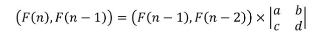
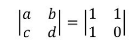
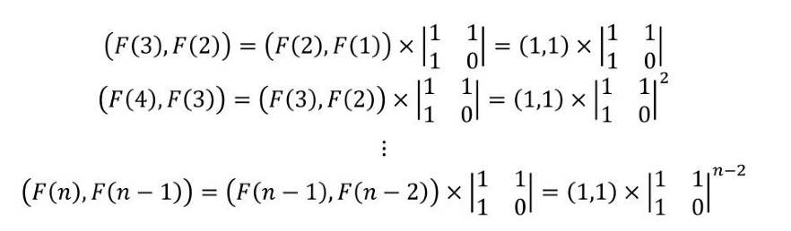

# 斐波那契数列的最优解
> 经典的算法问题了

**思路**
--------------------

在数学上可以将转换为如下形式




可以列写成为矩阵的形式



矩阵的乘方运算也是可以转换为快速运算的

比如

Matrix^7 = Matrix^1 * Matrix^2 * Matrix^4`
`

等于把7凑成2进制形式下的累乘

所以就可以快速的到n次的形式了

**代码**
--------------------
```python
def matrix_power(matrix:list, p:int):
    result = []
    temp = matrix
    power = p
    for row in range(0, len(matrix)):
        result.append([])
        for line in range(0, len(matrix[0])):
            if row == line:
                result[row].append(1)
            else:
                result[row].append(0)

    while power > 0:
        if power & 1 != 0:
            result = muli_matrix(result, temp)
        temp = muli_matrix(temp, temp)
        power = power >> 1
    return result


def muli_matrix(matrix1:list, matrix2:list):
    result = []
    for row in range(0, len(matrix1)):
        result.append([])
        for line in range(0, len(matrix2[0])):
            result[row].append(0)
            for k in range(0, len(matrix1[0])):
                result[row][line] += matrix1[row][k] * matrix2[k][line]
    return result


def f(n:int):
    if n == 2 or n == 1:
        return 1
    base = [[1, 1], [1, 0]]
    res = muli_matrix([[1, 1]], matrix_power(base, n - 2))
    return res[0][0]
```