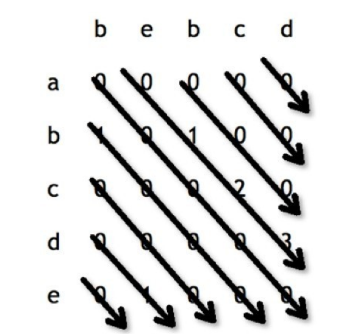

# 最长公共子串
> 类似上面的问题。不过这次是子串
> str1="1AB2345CD"，str2="12345EF"，返回"2345"。

**思路**

还是二维dp的问题
dp[i][j]表示str1[i]和str2[j]的以str1第i个字符结束的子串和str2的第j个字符结束的子串匹配长度

`
str1[i]!=str[j]
`

`
dp[i][j] = 0
`

`
str1[i]==str[j]
`

`
dp[i][j] = dp[i-1][j-1]+1
`

同时记录最大值即可
这个题还可以优化空间复杂度到1
因为当前的dp值之和左上方的值有关
所以可以斜着遍历
这样就可以只用常熟空间复杂度完成

同时记录end的位置
截取对应的子串即可

**代码**
```kotlin
fun getMaxLenSubString(str1: String, str2: String): String {
    if (str1.isEmpty() || str2.isEmpty()) {
        return ""
    }
    var end = 0
    var maxLen = 0
    var len = 0
    var i = 0
    var j = str2.lastIndex
    val loop = {
        len = 0
        while (i < str1.length && j < str2.length) {
            if (str1[i] == str2[j]) {
                len++
            } else {
                len = 0
            }
            if (len > maxLen) {
                maxLen = len
                end = i
            }
            i++
            j++
        }
    }
    while (j > 0) {
        i = 0
        val position = j
        loop()
        j = position - 1
    }
    i = 1
    while (i < str1.length) {
        j = 0
        val position = i
        loop()
        i = position + 1
    }
    return str1.substring(end - maxLen + 1, end + 1)
}
```